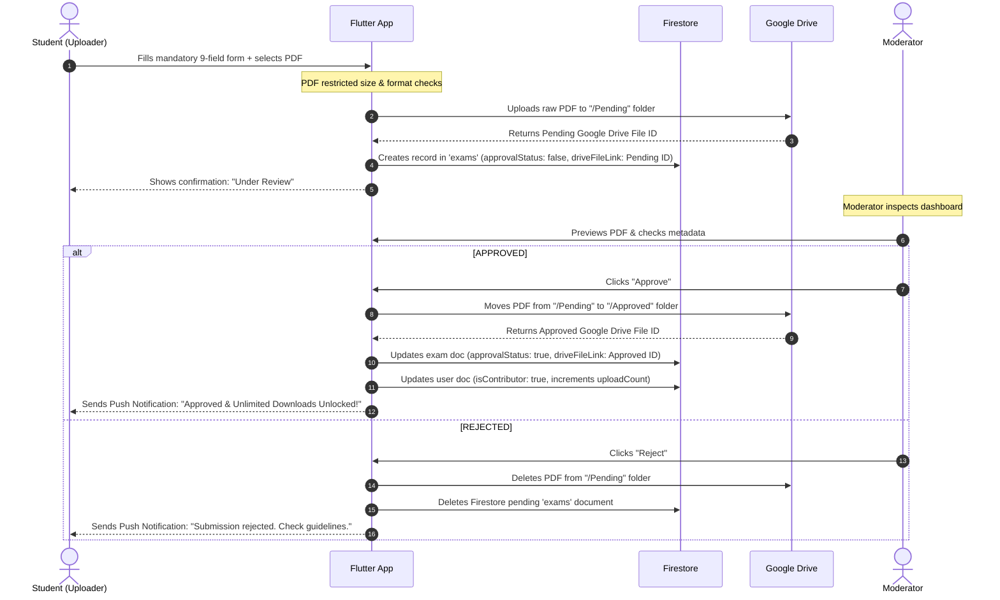

# Data Integrations & Storage Flow

## 1. Firestore Database Schema
The database uses two primary collections in Cloud Firestore: `exams` for document metadata and `users` for account state.

### `exams` Collection
Stores metadata for all exam papers. The files themselves are never stored in Firestore or Firebase Storage; instead, Firestore links directly to files hosted on Google Drive.

| Field | Type | Description / Values |
|---|---|---|
| `id` | String | Auto-generated Firestore Document ID |
| `moduleName` | String | Free text (e.g., "Algorithmique Avancée") |
| `year` | String | Format: "YYYY-YYYY" (e.g., "2025-2026") |
| `examType` | String | Dropdown selection: `Exam Cours`, `Exam Rattrapage`, `Exam TD`, `Exam TP`, `Fiche TD`, `Fiche TP` |
| `semester` | String | Radio button value: `"First"` or `"Second"` |
| `university` | String | Dropdown value (e.g., `"University of Ghardaia"`) |
| `department` | String | Free-text department label (structured in later versions) |
| `approvalStatus` | Boolean | `false` = pending review, `true` = approved and visible to users |
| `contributorId` | String | Firebase Auth UID of the uploader |
| `driveFileLink` | String | Direct Google Drive API link/ID to the approved PDF file |

#### Dropdown Values Details (`examType`)
- **Exam Cours**: Lecture / course-level final exam
- **Exam Rattrapage**: Makeup / resit exam
- **Exam TD**: Directed tutorial / worksheet-based exam
- **Exam TP**: Practical work / lab-based exam
- **Fiche TD**: TD worksheet or handout resources
- **Fiche TP**: TP worksheet or lab guide resources

---

### `users` Collection
Tracks authentication metadata and keeps count of user actions to govern the download limits.

| Field | Type | Description |
|---|---|---|
| `id` | String | Firebase Auth UID |
| `email` | String | User's registered email |
| `isContributor` | Boolean | `false` by default; permanently flips to `true` when their first uploaded exam is approved |
| `downloadCount` | Integer | Tracks number of downloads made by Standard users. Cleared or ignored once `isContributor` is true |
| `uploadCount` | Integer | Total count of approved exam uploads contributed by this user |
| `createdAt` | Timestamp | Timestamp when the user account was created |

---

## 2. Google Drive API Storage Flow
Because Firebase Storage is limited by tight bandwidth and storage limits on the free tier, the system integrates directly with **Google Drive** for all file storage, using a 2TB account. 

### Step-by-Step Upload & Review Pipeline

### Technical Integration Notes
- **Upload Constraints**: The Flutter client performs client-side validation, ensuring file uploads are strictly under 10MB and in PDF format.
- **Drive Folder Separation**:
  - `/Pending` folder: Configured with write-only access or write-only service account integration for uploaders to drop files.
  - `/Approved` folder: Configured so the service account can share files out directly or fetch them stream-by-stream.
- **API Quota Guardrails**: The free Google Drive API provides 1,000,000 quota units per minute. Fetching metadata costs 1 unit; downloading a file costs approximately 10 units. With local caching of metadata in Firestore and standard active user forecasts (~350 concurrent users downloading ~5 files each during exam periods), this flow operates safely within limits.
