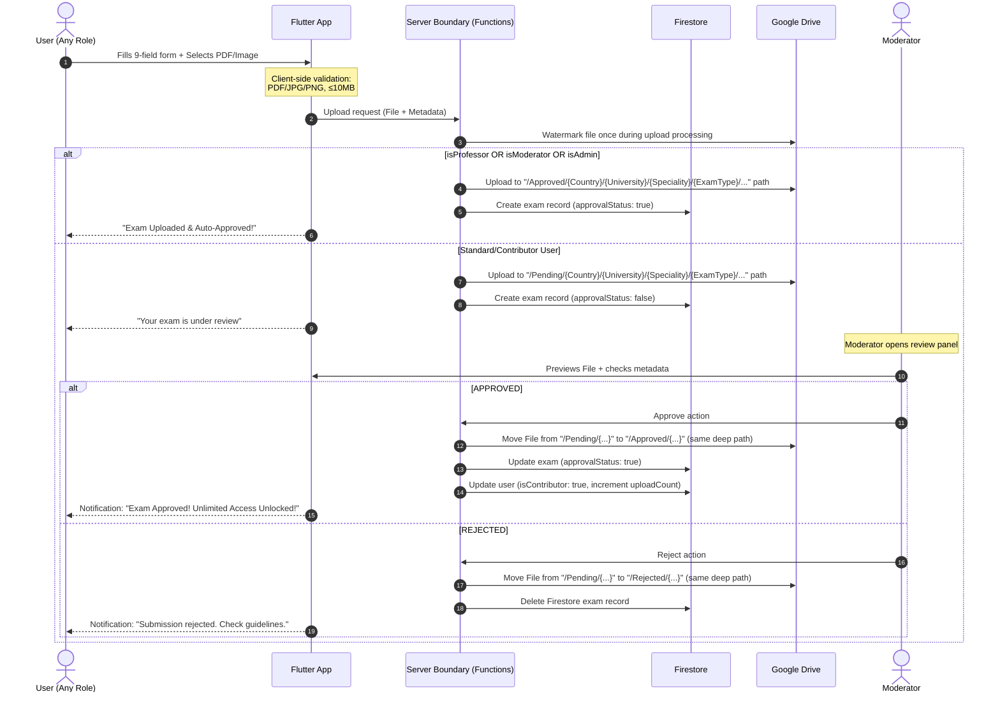
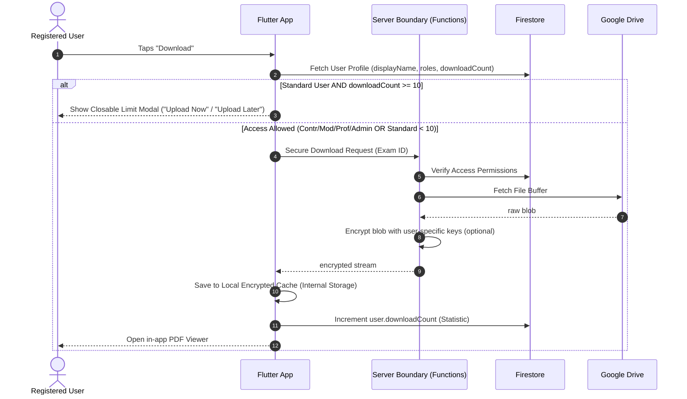
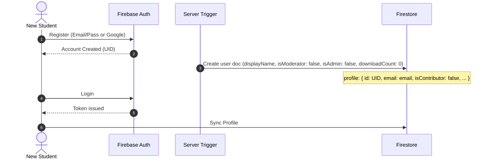

# Sequence Diagrams — ExaHub Flows

This file contains the core behavioral logic for ExaHub, from user uploads to moderator approvals and secure downloads.

---

## 1. Unified Upload & Review Pipeline

Covers Student uploads (Pending), Professor/Mod/Admin auto-approvals, and Moderator review flows.

---

## 2. Secure Download & Statistics Flow

All files are delivered as encrypted in-app cache blobs. Download counts are tracked for all users.

---

## 3. Account Initialization (Auth + Profile)

